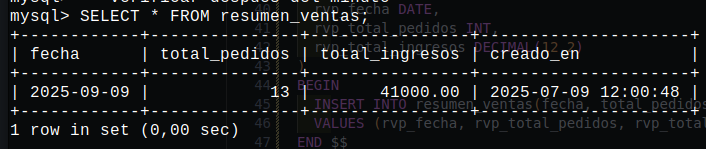

## Actividad

Haciendo uso de las siguientes tablas para la base de datos de `pizza` realice los siguientes ejercicios de `Events`  centrados en el uso de **ON COMPLETION PRESERVE** y **ON COMPLETION NOT PRESERVE** :

```sql

CREATE TABLE IF NOT EXISTS resumen_ventas (
fecha       DATE      PRIMARY KEY,
total_pedidos INT,
total_ingresos DECIMAL(12,2),
creado_en DATETIME DEFAULT CURRENT_TIMESTAMP
);

CREATE TABLE IF NOT EXISTS ingredientes (
    id              INT AUTO_INCREMENT PRIMARY KEY,
    nombre VARCHAR(80),
    categoria VARCHAR(80),
    stock INT NOT NULL DEFAULT 0
);

CREATE TABLE IF NOT EXISTS alerta_stock (
  id              INT AUTO_INCREMENT PRIMARY KEY,
  ingrediente_id  INT NOT NULL,
  stock_actual    INT NOT NULL,
  fecha_alerta    DATETIME NOT NULL,
  creado_en DATETIME DEFAULT CURRENT_TIMESTAMP,
  FOREIGN KEY (ingrediente_id) REFERENCES ingredientes(id)
);
```

## 1
1. Resumen Diario Único : crear un evento que genere un resumen de ventas **una sola vez** al finalizar el día de ayer y luego se elimine automáticamente llamado `ev_resumen_diario_unico`.
```sql
-- 1
-- SOLUCION 
-- procedimiento
DELIMITER $$

CREATE PROCEDURE ev_resumen_diario_unico (
  rvp_fecha DATE,
  rvp_total_pedidos INT,
  rvp_total_ingresos DECIMAL(12,2)
) 
BEGIN
  INSERT INTO resumen_ventas(fecha, total_pedidos, total_ingresos) 
  VALUES (rvp_fecha, rvp_total_pedidos, rvp_total_ingresos);
END $$

DELIMITER ;

-- evento
DELIMITER $$

CREATE EVENT resumen_ventas_event 
ON SCHEDULE  
  AT TIMESTAMP(DATE_SUB(CURDATE(), INTERVAL 1 SECOND))
ON COMPLETION NOT PRESERVE 
ENABLE 
COMMENT 'evento que saca resumen una vez al dia sin guardarse automaticamente'
DO
BEGIN 
  CALL ev_resumen_diario_unico('2025-09-09', 13, 41000.00);
END $$

DELIMITER ;
-- verificar despues del evento 
SELECT * FROM resumen_ventas;
```



## 2
2. Resumen Semanal Recurrente: cada lunes a las 01:00 AM, generar el total de pedidos e ingresos de la semana pasada, **manteniendo** el evento para que siga ejecutándose cada semana llamado `ev_resumen_semanal`.
```sql
-- solucion
```

## 3
3. Alerta de Stock Bajo Única: en un futuro arranque del sistema (requerimiento del sistema), generar una única pasada de alertas (`alerta_stock`) de ingredientes con stock < 5, y luego autodestruir el evento.
```sql
-- solucion
```

## 4 
4. Monitoreo Continuo de Stock: cada 30 minutos, revisar ingredientes con stock < 10 e insertar alertas en `alerta_stock`, **dejando** el evento activo para siempre llamado `ev_monitor_stock_bajo`.
```sql
-- solucion
```

## 5
5. Limpieza de Resúmenes Antiguos: una sola vez, eliminar de `resumen_ventas` los registros con fecha anterior a hace 365 días y luego borrar el evento llamado `ev_purgar_resumen_antiguo`.
```sql
-- solucion
```